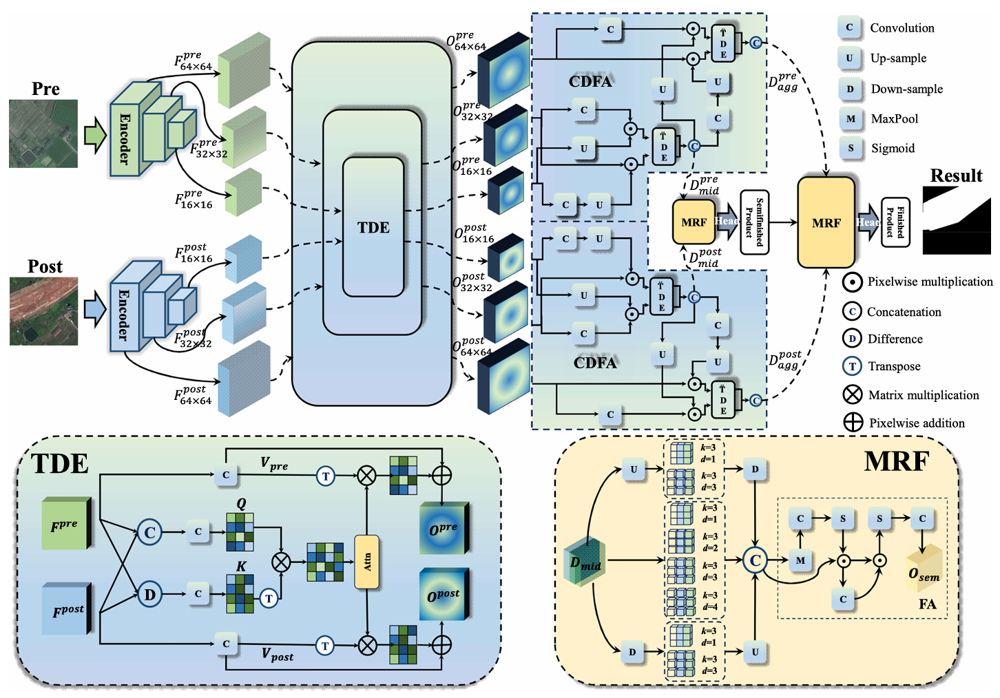
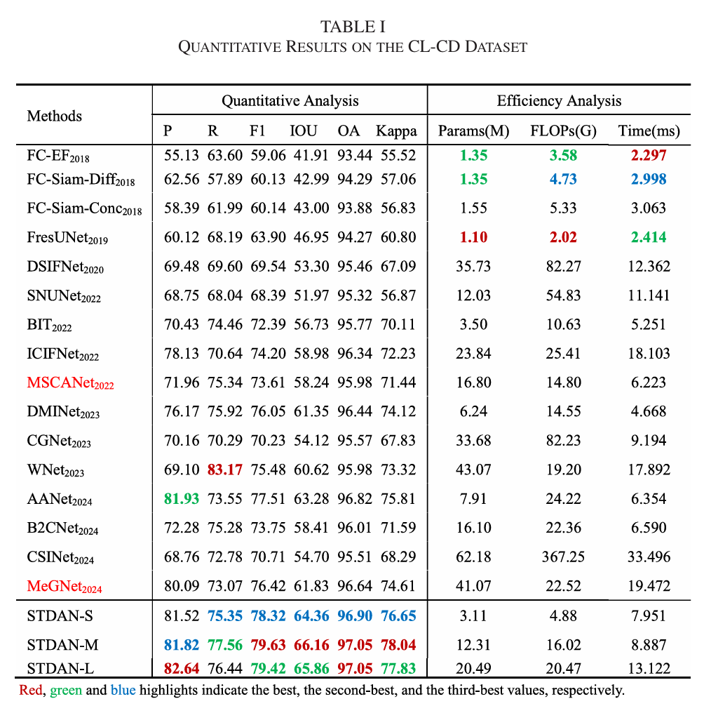

# A Spatial–Temporal Difference Aggregation Network for Gaofen-2 Multitemporal Image in Cropland Change Area
- Code for the paper: "A Spatial–Temporal Difference Aggregation Network for Gaofen-2 Multitemporal Image in Cropland Change Area", JSTARS 2025. [[IEEE JSTARS]](https://ieeexplore.ieee.org/document/10813395)

Methods
-----------------


Quantitative Comparison
-----------------


### :speech_balloon: Dataset Preparation

### :point_right: Data structure

```
"""
Change detection data set with pixel-level binary labels；
├─A
├─B
└─label
"""
```

`A`: images of t1 phase;

`B`: images of t2 phase;

`label`: label maps;

# Citation
```shell
@ARTICLE{10813395,
  author={Liu, Chuang and Bao, Liyang and Zhang, Zhiqi},
  journal={IEEE Journal of Selected Topics in Applied Earth Observations and Remote Sensing}, 
  title={A Spatial–Temporal Difference Aggregation Network for Gaofen-2 Multitemporal Image in Cropland Change Area}, 
  year={2025},
  volume={18},
  number={},
  pages={3160-3172},
  keywords={Charge coupled devices;Feature extraction;Remote sensing;Accuracy;Buildings;Support vector machines;Spatial resolution;Principal component analysis;Data mining;Transformers;Cropland change detection (CCD);Gaofen-2;multispectral image;multitemporal image;remote sensing},
  doi={10.1109/JSTARS.2024.3522066}}

```
